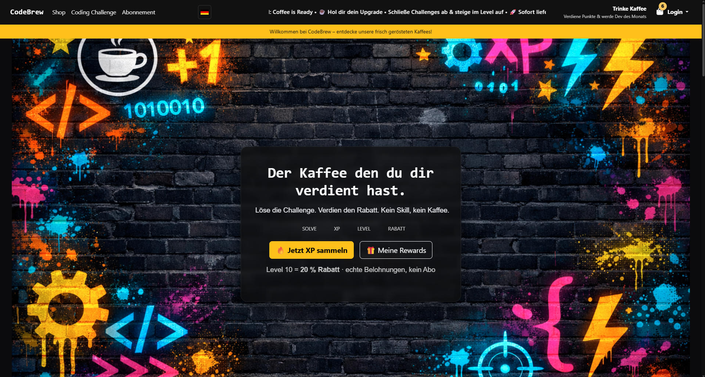

  

# ☕ CodeBrew Platform – Fuel for Devs

> **The first coffee shop where your logic pays the bills.** > Stop debugging on empty—solve challenges, earn XP, and unlock real-world coffee rewards. 🚀

---

### 📖 The Story
I’m a 19-year-old dev from Germany, and I spent the last few months building **CodeBrew** solo. I wanted to bridge the gap between coding culture and high-quality caffeine. 

At CodeBrew, coffee isn't just a commodity; it's the **reward for the work.**

### ⚔️ The Concept: No Gimmicks, Just Logic
Forget boring loyalty points. Here’s how you level up your setup:

1.  **Solve Coding Challenges:** Algorithms, Logic puzzles, and Bit Manipulation.
2.  **Earn XP:** Gain experience with every solved quest.
3.  **Unlock Rewards:** Leveling up grants you discounts (up to 20%) on our roasts like **"BUGFIX"**.

---

### 🗺️ Future Quests (Roadmap)
The platform is built to grow. While Batch #1 is officially live and shipping, I’m working on expanding the universe:

* **Advanced Loot:** New ways to utilize your XP as the community scales.
* **Special Events:** Time-limited coding challenges with unique rewards.
* **Collaborations:** High-level goals for the most dedicated brewers.
* *More details will be revealed as the backlog clears.*

---

### 🛠️ Tech Stack
Built with a mix of modern utility and solid foundations:
* **Frontend:** HTML5, CSS3, Vanilla JS
* **Styling:** Tailwind CSS & Bootstrap
* **Backend:** PHP
* **Logic:** Custom challenge-evaluation engine

---

### 💬 Feedback & Contribution
I’m a solo dev, so I’m looking for **brutal feedback**:
* How’s the UI/UX?
* Are the challenges too easy or too hard?
* What’s the one feature you'd ship next?

**Drop a ⭐ if you think developers deserve better fuel!**

🚀 **Status:** Production Ready & Shipping!  
🔗 **Join the Grind:** [codebrewbeans.com](https://codebrewbeans.com)
